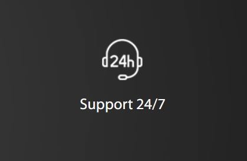

# 全球17个数据中心，GTHost让你的网站离用户更近一步

---

你的客户分散在全球各地，服务器却只在一个地方？每次打开网站都要等上好几秒？想覆盖更多地区的用户，但又担心速度跟不上？

GTHost成立于2012年，专门解决这个问题。他们在全球布置了17个数据中心，让你可以根据自己的业务需求，选择最合适的服务器位置和存储空间。不管你的用户在哪里，都能快速访问你的网站。

---

## GTHost是什么

GLOBALTELEHOST Corp.（简称GTHost）是一家成立于2012年的托管服务商。他们的目标很明确：提供性价比高的全球服务器服务。

这家平台最大的特点就是灵活。你可以根据自己需要的存储空间和地理位置来选择服务器，基本上想要什么配置都能定制。对于需要覆盖多个地区的业务来说，这种灵活性很实用。

## 17个数据中心分布在哪

GTHost在全球有17个数据中心位置可选。这意味着不管你的主要客户群在欧洲、亚洲还是美洲，都能找到距离他们比较近的服务器。服务器离用户越近，网站加载速度就越快，这是个简单但很重要的道理。

## 数据安全方面怎么样

数据丢了或者被攻击了，那损失可就大了。GTHost在安全方面做了这几件事：

首先是DDoS攻击防护。这种攻击能让你的网站瘫痪，GTHost会帮你挡住这些攻击。同时，平台也不允许用户对别人发起攻击，维护一个相对安全的环境。

其次是SSL加密。你存在服务器上的数据都会被加密保护，👉 [想要更稳定可靠的全球服务器方案，可以看看这里的具体配置](https://cp.gthost.com/en/join/72c7e6b2fc118929f9ede2978f008806)。

## 遇到问题能找到人吗

换了新的托管平台，刚开始肯定会有不熟悉的地方。有时候半夜出了问题，找不到人帮忙才是最头疼的。

GTHost提供24/7全天候支持。你可以通过电话、在线聊天或者邮件联系他们。不管是账单问题还是技术问题，都有对应的支持渠道。

## GTHost的几个主要特点

**无限带宽**

用着用着突然发现超出流量限制，还要额外付费？GTHost不设置带宽限制，也不会因为你用得多就收额外费用。对于流量不太稳定的网站来说，这点挺实用。

**快速部署**

买了服务器还要等好几天才能开始用？GTHost承诺5-15分钟内就能完成服务器设置。基本上付完款，喝杯咖啡的时间就能开始工作了。

**完全控制权**

有些托管商会限制你对服务器的操作权限。GTHost给你完全的root访问权限，服务器怎么配置、装什么软件，完全由你决定。当然，这也意味着你需要对自己的操作负责。

## GTHost提供哪些服务

GTHost主要提供的是专用服务器服务。你可以根据自己的需求定制配置，选择需要的存储空间、内存、CPU等硬件规格，再选择一个合适的数据中心位置。

价格从每月59美元起步，具体费用取决于你选择的配置。这种定制化的方式虽然没有固定套餐那么简单直接，但胜在灵活，能更精准地满足实际需求。

## 值得选择GTHost吗

对于需要全球多地部署服务器的业务来说，GTHost的17个数据中心位置确实是个优势。你可以根据用户分布选择最合适的服务器位置，这样能有效提升网站访问速度。

定制化的服务方案也比较灵活。不用为了用不上的功能付费，可以根据实际需求来配置服务器。不过这也意味着你需要对自己的需求有比较清楚的了解，不然可能选择起来会有点摸不着头脑。

## 常见问题

**GTHost有免费试用吗？**

不是完全免费，但有1-10天的低价试用期。具体政策可以去他们官网的服务条款页面查看详细说明。

**最低价格是多少？**

专用服务器的起步价是每月59美元。实际费用根据你选择的配置而定，配置越高价格越贵。

**支持方式有哪些？**

电话、在线聊天和邮件三种方式都支持。针对不同类型的问题（技术、账单等）有对应的联系渠道。

**都是专用服务器吗？**

是的，GTHost主要提供专用服务器服务。你可以选择不同位置、不同配置的专用服务器。

---

GTHost的核心优势在于广泛的全球数据中心布局和灵活的定制化方案。如果你的业务需要覆盖多个地区，又想保持稳定的访问速度，👉 [这个平台值得考虑](https://cp.gthost.com/en/join/72c7e6b2fc118929f9ede2978f008806)。毕竟服务器离用户越近，体验就越好，这个道理不会变。
